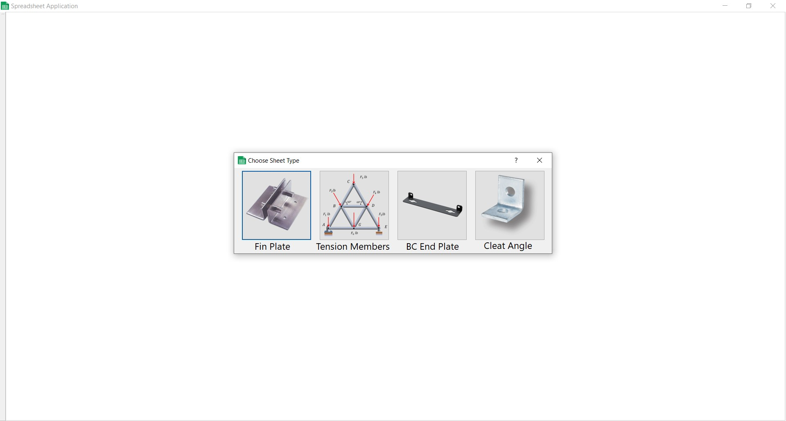
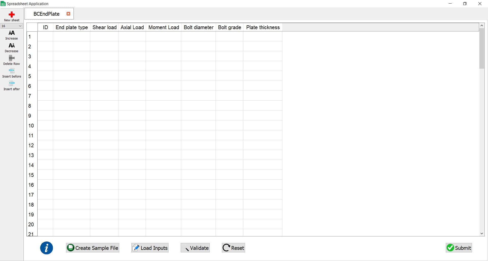

# Custom Spreadsheet Application

A custom spreadsheet application to add 4 types of tab modules namely:

1) Fin Plate

2) Tension Members

3) BC End Plate

4) Cleat Angle

The spreadsheet application has options of formatting like:

1) Add new tab module

2) Change font size

3) Delete a row

4) Insert a row

 **Note: The application can be download and used directly or installed using the installer included, as suits the need.**
